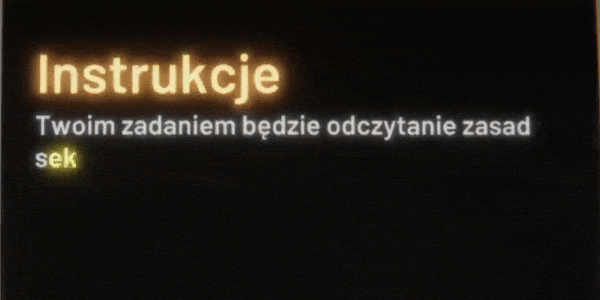

# 

illuminer is a promotional game made for AMU's new bioinformatics course. Game is available to play [here](none). 

Special thanks to originators:

- Szymon Błaszczyk

- [777moneymaker (Miłosz Chodkowski)](https://github.com/777moneymaker)

- [AvirFrog (Kacper)](https://github.com/AvirFrog)
  
  and to anybody who helped in the making process!

## Gameplay

Player's task is to read bases of a given sequence which are represented as coloured lights to imitate illumina sequencing. Colour assignments are displayed during the sequencing. Lights appear in random places at an increasing rate as player progresses through the sequence. The goal is to make as few mistakes as possible.
#### Gameplay sample (do not represent whole experience):

  
## Features

- WebGL game with available js hook - the goal was to make a leaderboard, but eventually there was no time for this. Even though, it's still possible, since there is nickname option in main menu (and code that dumps all info to potential js hook is available too)

- Tweened user interface, using [LeanTween](https://assetstore.unity.com/packages/tools/animation/leantween-3595)

- Focus on lights and post-processing usage (bloom, depth of field, vignetting, chromatic aberration, colour grading, exposure, lens distortion)

- Custom text tracking effect, similiar to which can be seen in Half-Life games. Example:
  
<table>
  <tr>
     <td>Half-Life 2 tracking</td>
     <td>illuminer tracking</td>
  </tr>
  <tr>
    <td></td>
    <td></td>
  </tr>
</table>

- Difficulty depends on designated sequence length - the longer the sequence, the more frequently lights appear (to certain point). This can be expressed as:
  
  <pre xml:lang="latex">(difficultyFactor^n) * maxInterval + minInterval</pre>
  
  where n is a subsequent base, maxInterval and minInterval are time values which can be achieved. difficultyFactor is constant. All results are rounded to two decimal places.

- Quite fun and challening gameplay!
